<h3><code>remy@github ~ $ whoami</code></h3>

<table>
<tr>
<td width="408" valign="top">

</td>
<td width="451" valign="top">

</td>
</tr>
</table>

 

<h3><code>remy@github ~ $ ./contributions.sh</code></h3>

 

<h3><code>remy@github ~ $ cat links.txt</code></h3>

- Portfolio: [remy-shift.dev](https://remy-shift.dev)
- LinkedIn: [remy-c](https://linkedin.com/in/r%C3%A9my-c-bb8b11296/)
- Instagram: [@remyshift](https://instagram.com/remyshift)
- Mail: contact@remy-shift.dev

 

Portrait and calendar are generated by the scripts in <code>scripts/</code>. The calendar refreshes daily through GitHub Actions.
