 

 

<a href="https://remy-shift.dev"><b>remy-shift.dev</b></a>
&nbsp;&middot;&nbsp;
<a href="https://www.linkedin.com/in/remy-cassagne">LinkedIn</a>
&nbsp;&middot;&nbsp;
<a href="mailto:contact@remy-shift.dev">contact@remy-shift.dev</a>

Generated by the scripts in <code>scripts/</code>. The calendar refreshes daily through GitHub Actions.
